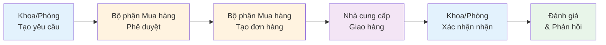
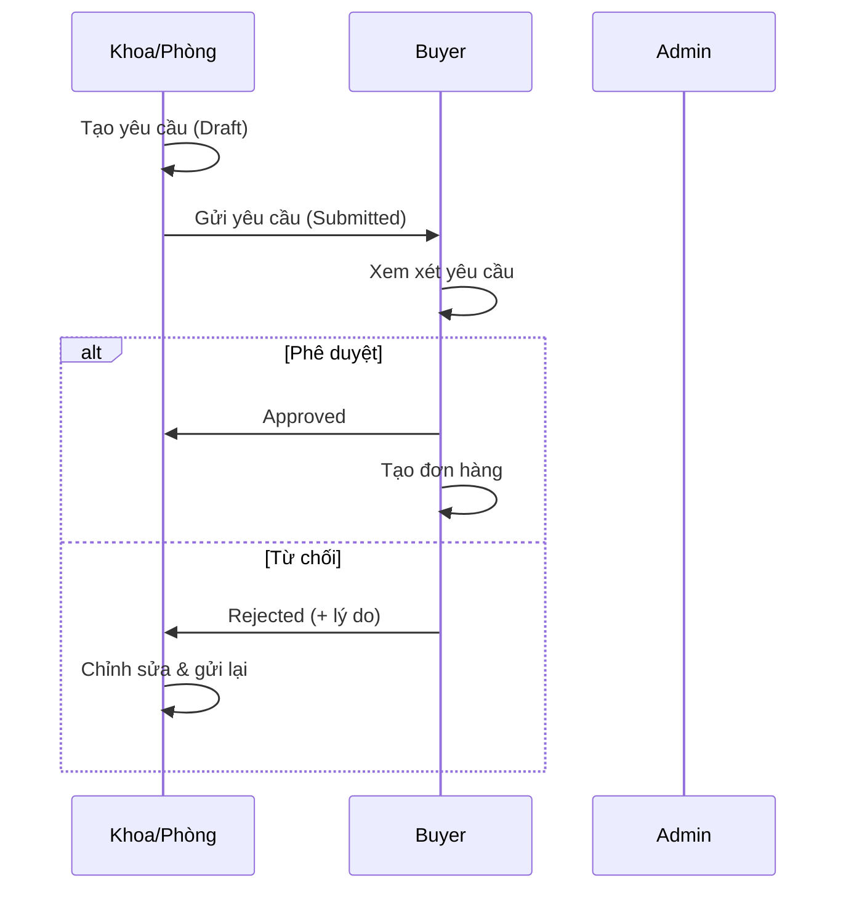
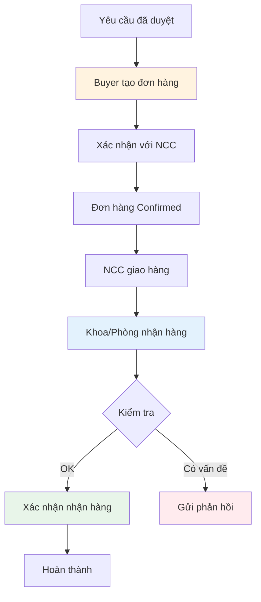
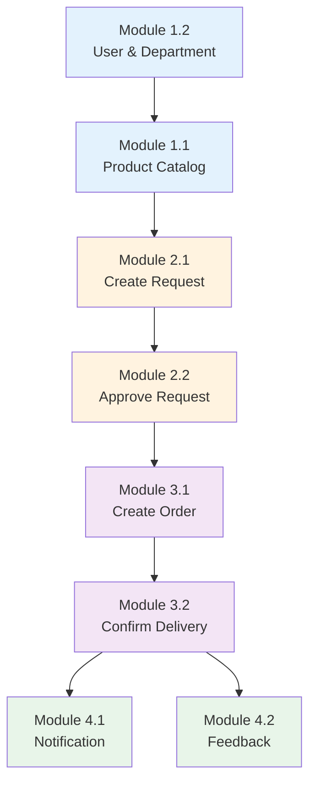

# PHÂN CHIA ĐỀ TÀI: HỆ THỐNG QUẢN LÝ MUA SẮM BỆNH VIỆN

## 🏥 Đề tài chính
**Hệ thống Quản lý Mua bán Hàng Nội bộ trong Bệnh viện**

---

## 📊 TỔNG QUAN QUY TRÌNH MUA SẮM



### Vai trò người dùng
- **Admin**: Quản trị hệ thống, quản lý danh mục, người dùng, báo cáo
- **Buyer (Bộ phận Mua hàng)**: Phê duyệt yêu cầu, tạo và quản lý đơn hàng
- **Department Staff (Nhân viên Khoa/Phòng)**: Tạo yêu cầu, xác nhận nhận hàng

---

## 🎯 PHÂN CHIA 4 MODULE VỚI 8 ĐỀ TÀI

---

## MODULE 1: QUẢN LÝ DANH MỤC VÀ CẤU HÌNH HỆ THỐNG

> **Mục tiêu**: Xây dựng nền tảng dữ liệu và cấu hình cho toàn bộ hệ thống

### 📌 Đề tài 1.1: Quản lý Danh mục Sản phẩm và Phân loại

**Vai trò**: Admin

**Mô tả**: 
Xây dựng hệ thống quản lý danh mục sản phẩm, thiết bị y tế, vật tư tiêu hao sử dụng trong bệnh viện. Đây là cơ sở dữ liệu quan trọng nhất cho toàn bộ quy trình mua sắm.

**Chức năng chính**:
- ✅ Quản lý danh mục sản phẩm (CRUD)
  - Thêm/sửa/xóa sản phẩm
  - Mã sản phẩm tự động (SKU)
  - Thông tin chi tiết: tên, mô tả, đơn vị tính, giá tham khảo
- ✅ Phân loại sản phẩm theo danh mục
  - Thiết bị y tế
  - Vật tư tiêu hao
  - Thuốc men
  - Văn phòng phẩm
- ✅ Tìm kiếm và lọc sản phẩm
- ✅ Import/Export danh sách sản phẩm

**Models**:
- `Product.php`
- `ProductCategory.php`

**Controllers**:
- `Admin\ProductController.php`
- `Admin\CategoryController.php`

**Routes**:
```php
Route::get('/admin/products', 'index')
Route::post('/admin/products', 'store')
Route::get('/admin/categories', 'index')
```

**Views**:
- `resources/views/admin/products/index.blade.php`
- `resources/views/admin/categories/index.blade.php`

---

### 📌 Đề tài 1.2: Quản lý Khoa/Phòng ban và Người dùng

**Vai trò**: Admin

**Mô tả**:
Xây dựng hệ thống quản lý cơ cấu tổ chức bệnh viện, quản lý người dùng và phân quyền theo vai trò.

**Chức năng chính**:
- ✅ Quản lý Khoa/Phòng ban
  - Thêm/sửa/xóa khoa/phòng
  - Mã khoa/phòng tự động
  - Thông tin: tên, mô tả, trưởng khoa
- ✅ Quản lý người dùng
  - Tạo tài khoản người dùng
  - Phân quyền: Admin, Buyer, Department Staff
  - Gán người dùng vào khoa/phòng
  - Reset mật khẩu
- ✅ Xác thực và phân quyền
  - Đăng nhập/Đăng xuất
  - Middleware phân quyền
  - Quản lý session

**Models**:
- `User.php`
- `Department.php`

**Controllers**:
- `AuthController.php`
- `Admin\DepartmentController.php`

**Routes**:
```php
Route::get('/login', 'showLogin')
Route::post('/login', 'login')
Route::get('/admin/departments', 'index')
Route::post('/admin/departments', 'store')
```

**Views**:
- `resources/views/auth/login.blade.php`
- `resources/views/admin/departments/index.blade.php`

---

## MODULE 2: QUẢN LÝ YÊU CẦU MUA HÀNG

> **Mục tiêu**: Quản lý quy trình tạo và phê duyệt yêu cầu mua hàng từ các khoa/phòng



### 📌 Đề tài 2.1: Tạo và Quản lý Yêu cầu Mua hàng (Department)

**Vai trò**: Department Staff

**Mô tả**:
Xây dựng chức năng cho phép nhân viên khoa/phòng tạo yêu cầu mua hàng, quản lý danh sách yêu cầu và theo dõi trạng thái.

**Chức năng chính**:
- ✅ Tạo yêu cầu mua hàng mới
  - Chọn sản phẩm từ danh mục
  - Nhập số lượng, ghi chú
  - Lưu nháp (Draft)
- ✅ Quản lý yêu cầu
  - Danh sách yêu cầu đang hoạt động
  - Lịch sử yêu cầu (Completed, Cancelled)
  - Chỉnh sửa yêu cầu nháp
  - Xóa yêu cầu
- ✅ Gửi yêu cầu để phê duyệt
- ✅ Rút lại yêu cầu (chuyển về nháp)
- ✅ Xem chi tiết và trạng thái yêu cầu

**Trạng thái yêu cầu**:
- `DRAFT`: Nháp
- `SUBMITTED`: Đã gửi, chờ duyệt
- `APPROVED`: Đã duyệt
- `REJECTED`: Từ chối
- `PROCESSING`: Đang xử lý
- `COMPLETED`: Hoàn thành
- `CANCELLED`: Đã hủy

**Models**:
- `PurchaseRequest.php`
- `PurchaseRequestItem.php`
- `Product.php`

**Controllers**:
- `Department\PurchaseRequestController.php`
  - `index()` - Danh sách yêu cầu đang hoạt động
  - `history()` - Lịch sử yêu cầu
  - `create()` - Form tạo mới
  - `store()` - Lưu yêu cầu
  - `edit()` - Form chỉnh sửa
  - `update()` - Cập nhật
  - `destroy()` - Xóa
  - `submit()` - Gửi yêu cầu
  - `withdraw()` - Rút yêu cầu

**Routes**:
```php
Route::resource('department/requests', 'PurchaseRequestController')
Route::get('department/requests/history/list', 'history')
Route::post('department/requests/{id}/submit', 'submit')
Route::post('department/requests/{id}/withdraw', 'withdraw')
```

**Views**:
- `resources/views/department/requests/index.blade.php`
- `resources/views/department/requests/history.blade.php`
- `resources/views/department/requests/create.blade.php`
- `resources/views/department/requests/edit.blade.php`
- `resources/views/department/requests/show.blade.php`

---

### 📌 Đề tài 2.2: Phê duyệt và Xử lý Yêu cầu (Buyer/Admin)

**Vai trò**: Buyer, Admin

**Mô tả**:
Xây dựng chức năng cho bộ phận mua hàng xem xét, phê duyệt hoặc từ chối yêu cầu mua hàng từ các khoa/phòng.

**Chức năng chính**:
- ✅ Danh sách yêu cầu chờ duyệt
  - Lọc theo khoa/phòng
  - Lọc theo trạng thái
  - Tìm kiếm theo mã yêu cầu
- ✅ Xem chi tiết yêu cầu
  - Thông tin khoa/phòng yêu cầu
  - Danh sách sản phẩm
  - Lịch sử thay đổi trạng thái
- ✅ Phê duyệt yêu cầu
  - Duyệt toàn bộ
  - Duyệt một phần (chọn sản phẩm)
  - Thêm ghi chú
- ✅ Từ chối yêu cầu
  - Nhập lý do từ chối
  - Gửi thông báo cho khoa/phòng
- ✅ So sánh giá từ nhiều nhà cung cấp
- ✅ Cập nhật trạng thái xử lý

**Models**:
- `PurchaseRequest.php`
- `PurchaseRequestWorkflow.php`
- `Notification.php`

**Controllers**:
- `Buyer\PurchaseRequestController.php`
  - `index()` - Danh sách yêu cầu
  - `approve()` - Phê duyệt
  - `reject()` - Từ chối
  - `updateStatus()` - Cập nhật trạng thái
  - `compare()` - So sánh giá

**Routes**:
```php
Route::get('buyer/requests', 'index')
Route::post('buyer/requests/{id}/approve', 'approve')
Route::post('buyer/requests/{id}/reject', 'reject')
Route::post('buyer/requests/{id}/update-status', 'updateStatus')
Route::get('buyer/requests/{id}/compare', 'compare')
```

**Views**:
- `resources/views/buyer/requests/index.blade.php`
- `resources/views/buyer/requests/show.blade.php`
- `resources/views/buyer/requests/compare.blade.php`

---

## MODULE 3: QUẢN LÝ ĐƠN HÀNG VÀ THỰC HIỆN MUA SẮM

> **Mục tiêu**: Quản lý quy trình tạo đơn hàng, mua sắm và giao nhận hàng hóa



### 📌 Đề tài 3.1: Tạo và Quản lý Đơn hàng Mua sắm (Buyer)

**Vai trò**: Buyer

**Mô tả**:
Xây dựng chức năng cho bộ phận mua hàng tạo đơn hàng từ các yêu cầu đã được phê duyệt, quản lý thông tin nhà cung cấp và theo dõi đơn hàng.

**Chức năng chính**:
- ✅ Tạo đơn hàng từ yêu cầu đã duyệt
  - Chuyển đổi tự động từ Purchase Request
  - Nhập thông tin nhà cung cấp
  - Nhập giá, điều khoản thanh toán
  - Ngày giao hàng dự kiến
- ✅ Quản lý đơn hàng
  - Danh sách đơn hàng
  - Lọc theo trạng thái
  - Tìm kiếm theo mã đơn
- ✅ Cập nhật trạng thái đơn hàng
  - Draft → Confirmed → Delivered → Completed
  - Thêm ghi chú cho mỗi lần cập nhật
- ✅ Quản lý file đính kèm
  - Upload hợp đồng
  - Upload hóa đơn
  - Upload chứng từ thanh toán

**Trạng thái đơn hàng**:
- `DRAFT`: Nháp
- `CONFIRMED`: Đã xác nhận với NCC
- `PROCESSING`: Đang xử lý
- `DELIVERED`: Đã giao hàng
- `COMPLETED`: Hoàn thành
- `CANCELLED`: Đã hủy

**Models**:
- `PurchaseOrder.php`
- `PurchaseOrderItem.php`
- `PurchaseRequest.php`
- `File.php`

**Controllers**:
- `Buyer\PurchaseOrderController.php`
  - `index()` - Danh sách đơn hàng
  - `create()` - Tạo đơn từ yêu cầu
  - `store()` - Lưu đơn hàng
  - `show()` - Chi tiết đơn hàng
  - `update()` - Cập nhật đơn hàng
- `Admin\PurchaseOrderController.php`
  - `index()` - Quản lý tất cả đơn hàng
  - `show()` - Xem chi tiết
  - `updateStatus()` - Cập nhật trạng thái

**Routes**:
```php
Route::get('buyer/orders', 'index')
Route::get('admin/orders', 'index')
Route::get('admin/orders/{id}', 'show')
Route::post('admin/orders/{id}/status', 'updateStatus')
```

**Views**:
- `resources/views/buyer/orders/index.blade.php`
- `resources/views/admin/orders/index.blade.php`
- `resources/views/admin/orders/show.blade.php`

---

### 📌 Đề tài 3.2: Theo dõi và Xác nhận Nhận hàng (Department)

**Vai trò**: Department Staff

**Mô tả**:
Xây dựng chức năng cho khoa/phòng theo dõi đơn hàng, xác nhận nhận hàng và báo cáo vấn đề (nếu có).

**Chức năng chính**:
- ✅ Danh sách đơn hàng của khoa/phòng
  - Đơn hàng đang chờ giao
  - Đơn hàng đã giao
  - Lịch sử đơn hàng
- ✅ Theo dõi trạng thái đơn hàng
  - Timeline tiến độ
  - Ngày giao hàng dự kiến
  - Thông tin nhà cung cấp
- ✅ Xác nhận nhận hàng
  - Kiểm tra số lượng
  - Kiểm tra chất lượng
  - Xác nhận hoặc báo cáo vấn đề
- ✅ Từ chối nhận hàng
  - Nhập lý do
  - Upload hình ảnh minh chứng
  - Gửi thông báo cho Buyer

**Models**:
- `PurchaseOrder.php`
- `PurchaseRequest.php`
- `Notification.php`
- `File.php`

**Controllers**:
- `Department\OrderController.php`
  - `index()` - Danh sách đơn hàng
  - `confirm()` - Xác nhận nhận hàng
  - `reject()` - Từ chối nhận hàng

**Routes**:
```php
Route::get('department/orders', 'index')
Route::post('department/orders/{id}/confirm', 'confirm')
Route::post('department/orders/{id}/reject', 'reject')
```

**Views**:
- `resources/views/department/orders/index.blade.php`
- `resources/views/department/orders/show.blade.php`

---

## MODULE 4: QUẢN LÝ THÔNG TIN VÀ ĐÁNH GIÁ

> **Mục tiêu**: Hỗ trợ thông tin, phản hồi và cải thiện chất lượng dịch vụ mua sắm

### 📌 Đề tài 4.1: Thông báo và Lịch sử Giao dịch

**Vai trò**: Tất cả người dùng

**Mô tả**:
Xây dựng hệ thống thông báo real-time và quản lý lịch sử giao dịch mua sắm.

**Chức năng chính**:
- ✅ Hệ thống thông báo
  - Thông báo yêu cầu mới (cho Buyer)
  - Thông báo phê duyệt/từ chối (cho Department)
  - Thông báo đơn hàng giao (cho Department)
  - Đánh dấu đã đọc
  - Xóa thông báo
- ✅ Lịch sử giao dịch
  - Lịch sử yêu cầu mua hàng
  - Lịch sử đơn hàng
  - Lọc theo thời gian
  - Xuất báo cáo Excel
- ✅ Dashboard tổng quan
  - Thống kê theo khoa/phòng
  - Thống kê theo thời gian
  - Biểu đồ xu hướng mua sắm

**Models**:
- `Notification.php`
- `PurchaseRequest.php`
- `PurchaseOrder.php`

**Controllers**:
- `Admin\NotificationController.php`
  - `index()` - Danh sách thông báo
  - `create()` - Tạo thông báo
  - `store()` - Lưu thông báo
  - `markAsRead()` - Đánh dấu đã đọc
  - `destroy()` - Xóa thông báo
- `Admin\PurchaseHistoryController.php`
  - `index()` - Lịch sử giao dịch
  - `export()` - Xuất Excel
- `Admin\DashboardController.php`
  - `index()` - Dashboard tổng quan

**Routes**:
```php
Route::get('admin/notifications', 'index')
Route::post('admin/notifications', 'store')
Route::post('admin/notifications/{id}/read', 'markAsRead')
Route::get('admin/history', 'index')
Route::get('admin/history/export', 'export')
Route::get('admin/dashboard', 'index')
```

**Views**:
- `resources/views/admin/notifications/index.blade.php`
- `resources/views/admin/history/index.blade.php`
- `resources/views/admin/dashboard.blade.php`

---

### 📌 Đề tài 4.2: Phản hồi và Báo cáo Thống kê

**Vai trò**: Department Staff (phản hồi), Admin (xử lý & báo cáo)

**Mô tả**:
Xây dựng hệ thống phản hồi chất lượng dịch vụ mua sắm và báo cáo thống kê chi tiết.

**Chức năng chính**:
- ✅ Gửi phản hồi
  - Đánh giá chất lượng sản phẩm (1-5 sao)
  - Đánh giá dịch vụ mua sắm
  - Nhập nội dung phản hồi
  - Upload hình ảnh minh chứng
- ✅ Quản lý phản hồi (Admin)
  - Danh sách phản hồi
  - Trả lời phản hồi
  - Đánh dấu đã xử lý
  - Thống kê mức độ hài lòng
- ✅ Báo cáo thống kê
  - Báo cáo tổng hợp theo khoa/phòng
  - Báo cáo chi phí mua sắm
  - Báo cáo sản phẩm được mua nhiều nhất
  - Báo cáo nhà cung cấp
  - Xuất PDF/Excel
- ✅ Hỗ trợ người dùng
  - Form liên hệ hỗ trợ
  - Gửi email hỗ trợ

**Models**:
- `PurchaseFeedback.php`
- `PurchaseOrder.php`
- `File.php`

**Controllers**:
- `Admin\FeedbackController.php`
  - `index()` - Danh sách phản hồi
  - `show()` - Chi tiết phản hồi
  - `reply()` - Trả lời
  - `resolve()` - Đánh dấu đã xử lý
- `Department\FeedbackController.php`
  - `create()` - Form phản hồi
  - `store()` - Gửi phản hồi
- `SupportController.php`
  - `show()` - Form hỗ trợ
  - `send()` - Gửi yêu cầu hỗ trợ

**Routes**:
```php
Route::get('admin/feedback', 'index')
Route::get('admin/feedback/{id}', 'show')
Route::post('admin/feedback/{id}/reply', 'reply')
Route::post('admin/feedback/{id}/resolve', 'resolve')
Route::get('support', 'show')
Route::post('support', 'send')
```

**Views**:
- `resources/views/admin/feedback/index.blade.php`
- `resources/views/admin/feedback/show.blade.php`
- `resources/views/support/contact.blade.php`

---

## 📊 MA TRẬN ÁNH XẠ CODE HIỆN TẠI

| Module | Đề tài | Controllers | Models | Views | Routes |
|--------|--------|-------------|--------|-------|--------|
| **1.1** | Danh mục Sản phẩm | ProductController<br/>CategoryController | Product<br/>ProductCategory | admin/products/*<br/>admin/categories/* | /admin/products<br/>/admin/categories |
| **1.2** | Khoa/Phòng & User | AuthController<br/>DepartmentController | User<br/>Department | auth/*<br/>admin/departments/* | /login<br/>/admin/departments |
| **2.1** | Tạo Yêu cầu | Department\PurchaseRequestController | PurchaseRequest<br/>PurchaseRequestItem | department/requests/* | /department/requests |
| **2.2** | Phê duyệt Yêu cầu | Buyer\PurchaseRequestController | PurchaseRequest<br/>PurchaseRequestWorkflow | buyer/requests/* | /buyer/requests |
| **3.1** | Tạo Đơn hàng | Buyer\PurchaseOrderController<br/>Admin\PurchaseOrderController | PurchaseOrder<br/>PurchaseOrderItem | buyer/orders/*<br/>admin/orders/* | /buyer/orders<br/>/admin/orders |
| **3.2** | Xác nhận Nhận hàng | Department\OrderController | PurchaseOrder | department/orders/* | /department/orders |
| **4.1** | Thông báo & Lịch sử | NotificationController<br/>PurchaseHistoryController<br/>DashboardController | Notification<br/>PurchaseRequest<br/>PurchaseOrder | admin/notifications/*<br/>admin/history/*<br/>admin/dashboard.blade.php | /admin/notifications<br/>/admin/history<br/>/admin/dashboard |
| **4.2** | Phản hồi & Báo cáo | Admin\FeedbackController<br/>SupportController | PurchaseFeedback<br/>File | admin/feedback/*<br/>support/* | /admin/feedback<br/>/support |

---

## 🎯 HƯỚNG DẪN TRIỂN KHAI

### Thứ tự ưu tiên phát triển



### Dependencies giữa các module

| Module | Phụ thuộc vào | Lý do |
|--------|---------------|-------|
| 1.1 | 1.2 | Cần có user để quản lý sản phẩm |
| 2.1 | 1.1, 1.2 | Cần có sản phẩm và user để tạo yêu cầu |
| 2.2 | 2.1 | Cần có yêu cầu để phê duyệt |
| 3.1 | 2.2 | Cần có yêu cầu đã duyệt để tạo đơn |
| 3.2 | 3.1 | Cần có đơn hàng để xác nhận |
| 4.1 | 2.1, 3.1 | Cần có dữ liệu để hiển thị lịch sử |
| 4.2 | 3.2 | Cần có đơn hàng hoàn thành để phản hồi |

### Công nghệ sử dụng

- **Backend Framework**: Laravel 10.x (PHP 8.1+)
- **Database**: MySQL 8.0+
- **Frontend**: 
  - Blade Templates
  - Tailwind CSS
  - Font Awesome Icons
  - Alpine.js (cho tương tác nhỏ)
- **Authentication**: Laravel Session-based Auth
- **File Upload**: Laravel Storage (local/S3)

### Cấu trúc thư mục

```
hospital-purchase/
├── app/
│   ├── Http/
│   │   └── Controllers/
│   │       ├── Admin/           # Module 1, 3.1, 4
│   │       ├── Buyer/           # Module 2.2, 3.1
│   │       ├── Department/      # Module 2.1, 3.2
│   │       ├── AuthController.php
│   │       └── SupportController.php
│   └── Models/
│       ├── User.php
│       ├── Department.php
│       ├── Product.php
│       ├── ProductCategory.php
│       ├── PurchaseRequest.php
│       ├── PurchaseRequestItem.php
│       ├── PurchaseRequestWorkflow.php
│       ├── PurchaseOrder.php
│       ├── PurchaseOrderItem.php
│       ├── PurchaseFeedback.php
│       ├── Notification.php
│       └── File.php
├── database/
│   └── migrations/
├── resources/
│   └── views/
│       ├── admin/
│       ├── buyer/
│       ├── department/
│       ├── auth/
│       ├── support/
│       └── layouts/
├── routes/
│   └── web.php
└── public/
    ├── css/
    ├── js/
    └── uploads/
```

---

## 📝 TỔNG KẾT

### Điểm mạnh của cách phân chia này

✅ **Phù hợp với quy trình thực tế**: Phản ánh đúng workflow mua sắm trong bệnh viện

✅ **Phân chia rõ ràng theo vai trò**: Mỗi module gắn với vai trò người dùng cụ thể

✅ **Độc lập cao**: Mỗi đề tài có thể triển khai và test riêng biệt

✅ **Dễ mở rộng**: Có thể thêm chức năng mới vào từng module mà không ảnh hưởng module khác

✅ **Có thứ tự triển khai logic**: Module 1 → 2 → 3 → 4

### So sánh với phiên bản cũ

| Tiêu chí | Phiên bản cũ | Phiên bản mới |
|----------|--------------|---------------|
| Cách phân chia | Theo chức năng kỹ thuật | Theo quy trình nghiệp vụ |
| Tính logic | Trung bình | Cao |
| Dễ hiểu | Khó (cho người không kỹ thuật) | Dễ (cho cả nghiệp vụ) |
| Độc lập module | Thấp (chồng chéo) | Cao (rõ ràng) |
| Khả năng triển khai | Khó xác định thứ tự | Có roadmap rõ ràng |

---

**Ngày tạo**: 08/01/2026  
**Phiên bản**: 2.0 (Improved)  
**Người thực hiện**: Hospital Purchase System Team

---

## 📞 Liên hệ hỗ trợ

Nếu có thắc mắc về phân chia đề tài, vui lòng liên hệ:
- Email: support@hospital-purchase.vn
- Hotline: 1900-xxxx
